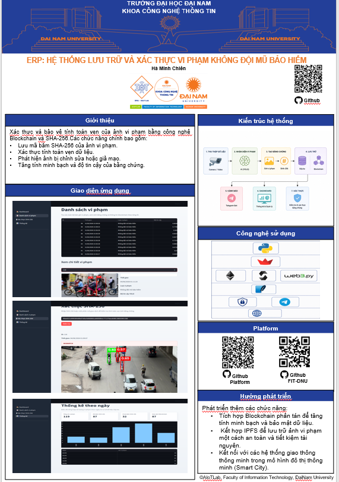

# 🛡️ HỆ THỐNG LƯU TRỮ VÀ XÁC THỰC VI PHẠM KHÔNG ĐỘI MŨ BẢO HIỂM

    

        
        
        
    

<h3 align="center">🚦 Giải pháp phát hiện và xác thực vi phạm giao thông bằng AI và Blockchain</h3>

<strong>
Hệ thống sử dụng mô hình YOLOv8 để phát hiện người điều khiển xe máy không đội mũ bảo hiểm từ hình ảnh và video. Dữ liệu vi phạm được lưu trữ bằng SQLite, tạo mã băm SHA-256 và xác thực trên Blockchain nhằm đảm bảo tính toàn vẹn, minh bạch và chống giả mạo bằng chứng vi phạm.
</strong>

---

## 📝 Giới thiệu dự án

Dự án tập trung vào việc xác thực và bảo vệ tính toàn vẹn của ảnh vi phạm bằng công nghệ Blockchain kết hợp mã băm SHA-256. Các chức năng cốt lõi bao gồm:
* **Lưu mã băm SHA-256** của ảnh vi phạm gốc để tạo dấu vết số cố định.
* **Xác thực tính toàn vẹn** dữ liệu nhanh chóng và trực quan ngay trên giao diện Web.
* **Phát hiện ảnh bị chỉnh sửa** hoặc các hành vi làm sai lệch, giả mạo bằng chứng.
* **Nâng cao tính minh bạch** và độ tin cậy tuyệt đối cho quy trình xử lý vi phạm giao thông.

---

## 🏗️ Porter dự án

  

## ✨ Tính năng chính

### 🧠 Trí tuệ nhân tạo (Computer Vision)
* Phát hiện chính xác người đội mũ bảo hiểm và không đội mũ bảo hiểm.
* Xử lý mượt mà trên cả hình ảnh tĩnh và luồng video tải lên.
* Hỗ trợ nhận diện, khoanh vùng nhiều đối tượng (Multi-object) cùng lúc với độ tin cậy ($Confidence$) cao.

### 🔐 Blockchain & Bảo mật dữ liệu
* Băm ảnh bằng chứng theo chuẩn công nghiệp **SHA-256**.
* Tương tác với Smart Contract để lưu trữ dấu vết điện tử (Proof of Existence) trên Blockchain.
* Cơ chế đối sánh mã băm hỗ trợ phát hiện ngay lập tức nếu dữ liệu ảnh bị thay đổi dù chỉ 1 pixel.

### 📊 Quản lý & Thống kê
* Quản lý danh sách vi phạm tập trung, bộ lọc tìm kiếm thông minh theo mã băm SHA-256.
* Biểu đồ cột trực quan theo dõi biến động số ca vi phạm theo các mốc thời gian trong ngày.

### 📱 Thông báo tức thời
* Bắn thông báo tự động thông qua **Telegram Bot** gồm: *Ảnh chụp vi phạm*, *Mã băm SHA-256* và *Mã hash giao dịch (TxHash)* trên Blockchain.

---

## 🔧 Công nghệ sử dụng

* **Ngôn ngữ lập trình:** Python (xử lý logic AI, Backend và tương tác Web3)
* **Trí tuệ nhân tạo:** Ultralytics YOLOv8, OpenCV
* **Giao diện ứng dụng:** Streamlit
* **Cơ sở dữ liệu:** SQLite
* **Nền tảng Blockchain:** Ethereum Network, Web3.py
* **Giao tiếp & Cảnh báo:** Telegram Bot API

---

